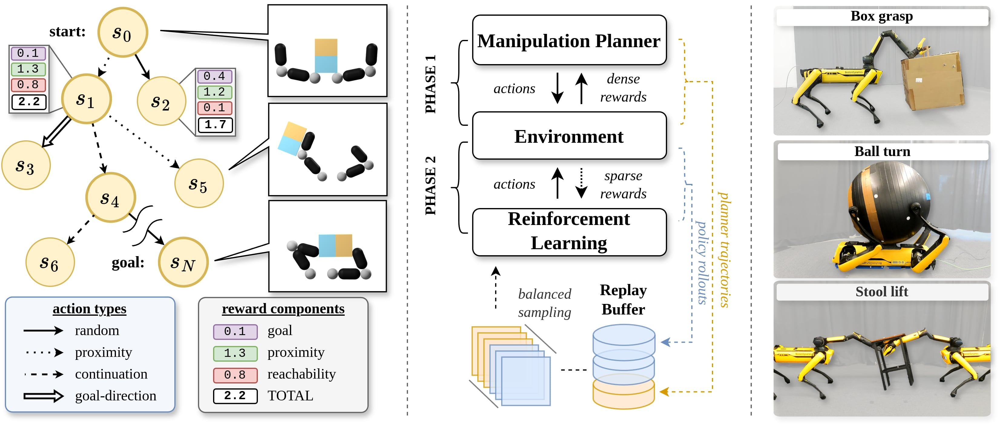

# judo
[](https://github.com/bdaiinstitute/judo/actions/workflows/build.yml)
[](https://codecov.io/gh/bdaiinstitute/judo)
[](https://github.com/bdaiinstitute/judo/actions/workflows/docs.yml)
[](https://bdaiinstitute.github.io/judo)


> **Disclaimer**
> This code is released in conjunction with the publication of _"Jacta: A Versatile<br>
> Planner for Learning Dexterous and Whole-body Manipulation."_ It is provided<br>
> as a research prototype and is not production-quality software. Please note<br>
> that the code may contain missing features and potential bugs. As part of this<br>
> release, the RAI Institute does not offer maintenance or support for the software.

## Jacta: A Versatile Planner for Learning Dexterous and Whole-body Manipulation
<div align="center">

[](https://arxiv.org/pdf/2408.01258)
[](https://judo.github.io/)
[](https://rai-inst.com/resources/papers/jacta-a-versatile-planner-for-learning-dexterous-and-whole-body-manipulation/)

</div>
Robotic manipulation is challenging and data-driven approaches typically require large amounts of data or expert demonstrations. Therefore, we introduce a motion planner for dexterous and whole-body manipulation tasks. The planner's demonstrations can directly be used by reinforcement learning. With this approach, we can efficiently learn policies for complex manipulation tasks, where traditional reinforcement learning alone only makes little progress.




### Installation
Install cmake
```
sudo apt install cmake
```

Install mujoco_extensions
```
git clone https://github.com/bdaiinstitute/judo.git
cd judo
pip install src/mujoco_extensions -vv
```

Install judo
```
pip install -e .
```

### Getting started
```
python src/judo/visualizers/viser_app/app.py
```
Open the visualizer in your browser by clicking on the link in the terminal.
```
http://localhost:8080/
```

### Citation
```
@inproceedings{brudigam2024jacta,
  author       = {Br{\"u}digam, Jan and Abbas, Ali-Adeeb and Sorokin, Maks and Fang, Kuan and Hung, Brandon and Guru, Maya and Sosnowski, Stefan and Wang, Jiuguang and Hirche, Sandra and Le Cleac'h, Simon},
  editor       = {Agrawal, Pulkit and Kroemer, Oliver and Burgard, Wolfram},
  title        = {Jacta: {A} Versatile Planner for Learning Dexterous and Whole-body Manipulation},
  booktitle    = {Conference on Robot Learning, 6-9 November 2024, Munich, Germany},
  series       = {Proceedings of Machine Learning Research},
  volume       = {270},
  pages        = {994--1020},
  publisher    = {{PMLR}},
  year         = {2024},
  url          = {https://proceedings.mlr.press/v270/bruedigam25a.html},
}
```

### Run tests locally
In the virtual environment
```
pip install -e .[dev]
python -m pytest
```
you might have to
```
unset PYTHONPATH
```
